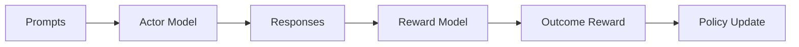
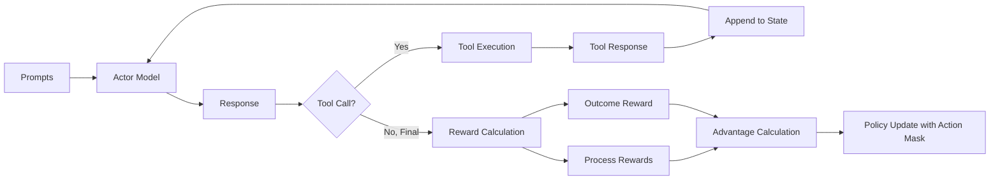

# 核心概念详解

本文档深入介绍 Agent-R1 的核心理论基础，包括 MDP 框架的扩展、状态空间、动作空间、状态转移和奖励函数的定义。

---

## 从 LLM 到 Agent：MDP 视角

大型语言模型（LLM）应用中固有的序列决策过程可以在马尔可夫决策过程（MDP）框架内有效地表述。然而，将 MDP 公式从静态、单轮文本生成任务（如数学或代码生成）演化为适用于 LLM Agent 的动态、多轮、丰富交互环境对话的形式，需要实质性的扩展。

### 核心差异对比

| MDP 组件 | 静态 LLM | LLM Agent |
|----------|----------|-----------|
| **状态空间 (S)** | 仅捕获当前文本序列 | 捕获多轮交互的完整历史和环境反馈 |
| **动作空间 (A)** | 生成下一个 token | 生成 token，同时可作为调用外部工具的命令 |
| **状态转移 (P)** | 确定性：追加 token 确定下一状态 | 随机性：下一状态依赖于环境的非确定性反馈 |
| **奖励函数 (R)** | 在生成结束时获得单一稀疏奖励 | 除最终奖励外，还获得中间步骤的密集过程奖励 |

---

## 状态空间 (State Space, S)

### 静态 LLM 的状态

在单轮文本生成中，状态 $s_t$ 主要封装当前文本上下文，包括初始提示 $w_p$ 和到目前为止生成的 token 序列：

$$s_t = (w_p, w_1, w_2, \ldots, w_t)$$

状态空间专注于捕获预测下一个连贯 token 所需的信息。

### LLM Agent 的状态

对于参与多轮交互的 Agent，状态 $s_t$ 需要更加全面。它不仅需要保留文本上下文，还需要保留交互历史和环境反馈：

$$s_t = (w_p, T_1, T_2, \ldots, T_k, T_{k+1}^{partial})$$

其中：
- $T_i$ 表示一个完整的交互轮次，包含 Agent 生成的 token 和随后的环境反馈
- $T_i = (w_{i1}, \ldots, w_{iT_i}, w_{ei})$
- $w_{ei}$ 是第 $i$ 轮的环境反馈（如工具调用结果）
- $T_{k+1}^{partial}$ 表示当前正在进行的轮次中部分生成的序列

这种丰富的状态表示使 Agent 能够基于对话和环境结果的完整历史做出决策。

### 状态示例

```
状态组成示例：

初始提示 (w_p): "请回答：谁是美国第一任总统？他的出生地在哪里？"

第一轮交互 (T_1):
  - Agent 生成: "<think>这是一个多跳问题，需要先找到第一任总统...</think>
                <tool_call>{"name": "wikisearch", "arguments": {"query": "第一任美国总统"}}</tool_call>"
  - 环境反馈: "<tool_response>乔治·华盛顿是美国第一任总统...</tool_response>"

第二轮交互 (T_2):
  - Agent 生成: "<think>现在我知道是华盛顿，需要查询他的出生地...</think>
                <tool_call>{"name": "wikisearch", "arguments": {"query": "乔治华盛顿出生地"}}</tool_call>"
  - 环境反馈: "<tool_response>华盛顿出生于弗吉尼亚州威斯特摩兰县...</tool_response>"

当前部分 (T_3^partial):
  - Agent 正在生成: "<think>我已经收集到所有信息...</think>
                     <answer>美国第一任总统是乔治·华盛顿，他出生于弗吉尼亚州</answer>"
```

---

## 动作空间 (Action Space, A)

### 静态 LLM 的动作

动作 $a_t$ 对应于从 LLM 词汇表 $V$ 中选择下一个 token $w_{t+1}$：

$$a_t \in A(s_t) = V$$

### LLM Agent 的动作

Agent 的动作 $a_t$ 同样是从词汇表 $V$ 中选择下一个 token。然而，动作序列的含义可以更广泛：

- **常规 token**: 用于推理、思考或生成最终答案
- **工具触发 token**: 特定的 token 序列被解释为调用外部工具或 API 的命令

例如，生成 `<tool_call>` 标签表示开始工具调用，而 `</tool_call>` 表示工具调用结束。

### 动作类型

```
动作类型：

1. 推理动作
   生成: "<think>让我分析这个问题...</think>"

2. 工具调用动作
   生成: '<tool_call>{"name": "wikisearch", "arguments": {"query": "..."}}</tool_call>'

3. 最终回答动作
   生成: "<answer>最终答案是...</answer>"
```

---

## 状态转移概率 (State Transition Probability, P)

### 静态 LLM 的状态转移

LLM 文本生成中的状态转移是**确定性的**。给定当前状态 $s_t$ 和动作 $a_t$（选择 token $w_{t+1}$），下一个状态 $s_{t+1}$ 由将 $w_{t+1}$ 追加到当前序列唯一确定：

$$P(s_{t+1}|s_t, a_t) = \begin{cases} 1, & \text{if } s_{t+1} = s_t \oplus a_t \\ 0, & \text{otherwise} \end{cases}$$

其中 $\oplus$ 表示序列连接。

### LLM Agent 的状态转移

Agent 的状态转移机制通过纳入环境交互引入了关键区别，这可能是**随机的**。转移可以根据动作是否触发环境交互来分类：

$$P(s_{t+1}|s_t, a_t) = \begin{cases} P_E(s_{t+1}|s_t, a_t), & \text{if } a_t \text{ 触发工具/环境交互} \\ P_G(s_{t+1}|s_t, a_t), & \text{otherwise（标准 token 生成）} \end{cases}$$

- **$P_G$（生成转移）**: 镜像静态 LLM 的确定性 token 生成
- **$P_E$（环境转移）**: 反映工具执行和环境响应中固有的不确定性

### 状态转移示意图

```mermaid
graph LR
    A[状态 s_t] -->|常规 token| B[确定性转移 P_G]
    A -->|工具调用 token| C[环境转移 P_E]
    B --> D[s_{t+1} = s_t ⊕ a_t]
    C --> E[s_{t+1} = s_t ⊕ a_t ⊕ env_response]
    C -.->|不确定性| F[工具执行结果]
    F --> E
```

### 环境转移的随机性来源

1. **网络延迟**: API 调用可能超时或失败
2. **搜索结果变化**: 同一查询可能返回不同结果
3. **代码执行**: 程序可能有运行时错误
4. **外部服务状态**: 依赖服务的可用性

---

## 奖励函数 (Reward Function, R)

### 静态 LLM 的奖励

奖励通常是**稀疏的**，仅在完整生成序列结束时提供，即到达终端状态 $s_T$ 时。这通常是基于结果的奖励 $R(s_T)$，评估生成文本的整体质量。

### LLM Agent 的奖励

Agent 的奖励结构通常更**丰富**和**密集**，以适应其任务的多轮性质：

$$R(s_t, a_t, s_{t+1}) = \begin{cases} r_f(s_{t+1}), & \text{if } s_{t+1} \text{ 是终端状态} \\ r_p(s_t, a_t, s_{t+1}), & \text{if } a_t \text{ 触发重要中间事件} \\ 0, & \text{otherwise（常规 token 生成）} \end{cases}$$

其中：
- **$r_f(s_{t+1})$**: 最终结果奖励（Outcome Reward），用于任务完成
- **$r_p(s_t, a_t, s_{t+1})$**: 过程奖励（Process Reward），用于成功执行中间步骤

### 奖励类型详解

#### 1. 结果奖励 (Outcome Reward)

在任务完成时评估最终答案的正确性：

```python
# 示例：QA 任务的结果奖励
def compute_outcome_reward(prediction, ground_truth):
    # 精确匹配
    em_score = int(prediction.strip().lower() == ground_truth.strip().lower())
    return em_score
```

#### 2. 过程奖励 (Process Reward)

在每个工具调用后评估中间步骤的有效性：

```python
# 示例：工具调用的过程奖励
def compute_process_reward(tool_call_success, tool_response_quality):
    if not tool_call_success:
        return -0.1  # 工具调用失败惩罚

    if tool_response_quality == "relevant":
        return 0.1   # 相关响应奖励
    else:
        return 0.0   # 中性
```

### Agent-R1 的奖励公式

Agent-R1 使用以下奖励公式：

$$r_f = \begin{cases} r_{answer}, & \text{if } r_{format} = 1 \\ r_{format} - 1, & \text{if } r_{format} < 1 \end{cases}$$

其中：
- $r_{answer} = EM(a_{pred}, a_{gold})$ 是精确匹配分数
- $r_{format} = (r_{format_a} + r_{format_t}) / 2$ 是格式正确性分数
  - $r_{format_a}$: 最终答案格式是否正确
  - $r_{format_t}$: 工具调用语法是否正确

---

## Action Mask：区分代理动作与环境反馈

### 为什么需要 Action Mask？

在多轮交互中，轨迹包含：
1. **Agent 生成的 token**: 代理的决策，应该参与梯度计算
2. **环境反馈的 token**: 工具响应或系统消息，不应参与梯度计算

Action Mask 用于标识轨迹中哪些 token 是 Agent 的动作。

### Action Mask 示例

```
轨迹: <think>需要搜索</think><tool_call>{"name":"search"}</tool_call><tool_response>结果</tool_response><answer>答案</answer>

Token:     [<think>] [需要] [搜索] [</think>] [<tool_call>] [...] [</tool_call>] [<tool_response>] [结果] [</tool_response>] [<answer>] [答案] [</answer>]
Action Mask:  1        1      1       1           1          ...       1              0              0           0             1          1         1
```

### Action Mask 在训练中的作用

```python
# 在计算策略损失时使用 Action Mask
def compute_policy_loss(log_probs, advantages, action_mask):
    # 只对 Agent 动作计算损失
    masked_log_probs = log_probs * action_mask
    masked_advantages = advantages * action_mask

    # PPO 损失计算
    loss = -torch.sum(masked_log_probs * masked_advantages) / torch.sum(action_mask)
    return loss
```

---

## 单轮 RL vs 多轮 RL

### 单轮 RL（传统 LLM 训练）



特点：
- 一次性生成完整响应
- 仅有最终奖励
- 确定性状态转移

### 多轮 RL（Agent-R1）



特点：
- 多轮交互，迭代生成
- 过程奖励 + 结果奖励
- 随机状态转移（环境交互）
- Action Mask 区分动作与反馈

---

## 优势估计与 Action Mask 对齐

### 优势函数

优势函数 $\hat{A}_t$ 衡量在状态 $s_t$ 采取动作 $a_t$ 相比于平均水平好多少：

$$\hat{A}_t = Q(s_t, a_t) - V(s_t)$$

### GAE（广义优势估计）

$$\hat{A}_t^{GAE} = \sum_{l=0}^{\infty} (\gamma \lambda)^l \delta_{t+l}$$

其中 $\delta_t = r_t + \gamma V(s_{t+1}) - V(s_t)$ 是 TD 误差。

### Action Mask 对齐的优势

在 Agent-R1 中，优势计算需要与 Action Mask 对齐：

```python
def compute_aligned_advantage(rewards, values, action_mask, gamma=0.99, lambda_=0.95):
    """
    计算与 Action Mask 对齐的优势
    """
    advantages = []
    gae = 0

    for t in reversed(range(len(rewards))):
        if action_mask[t] == 0:
            # 非 Agent 动作，不计算优势
            advantages.insert(0, 0)
            continue

        delta = rewards[t] + gamma * values[t+1] - values[t]
        gae = delta + gamma * lambda_ * gae
        advantages.insert(0, gae)

    return advantages
```

---

## 支持的 RL 算法

Agent-R1 支持多种强化学习算法：

### 1. PPO (Proximal Policy Optimization)

使用值函数和 GAE 进行优势估计：

$$L^{CLIP}(\theta) = \mathbb{E}_t \left[ \min \left( r_t(\theta) \hat{A}_t, \text{clip}(r_t(\theta), 1-\epsilon, 1+\epsilon) \hat{A}_t \right) \right]$$

### 2. GRPO (Group Relative Policy Optimization)

按 prompt 分组进行相对优势计算，无需 Critic：

$$\hat{A}_i = \frac{r_i - \mu(r)}{\sigma(r)}$$

### 3. REINFORCE++

累积回报计算：

$$G_t = \sum_{k=t}^{T} \gamma^{k-t} r_k$$

### 4. RLOO (Leave-One-Out)

使用组内其他样本作为基线：

$$\hat{A}_i = r_i - \frac{1}{n-1} \sum_{j \neq i} r_j$$

---

## 总结

Agent-R1 通过以下关键扩展将 MDP 框架适配到 LLM Agent：

1. **状态空间扩展**: 包含完整的多轮交互历史和环境反馈
2. **动作语义扩展**: token 生成可触发外部工具调用
3. **状态转移扩展**: 纳入环境交互的随机性
4. **奖励结构扩展**: 过程奖励 + 结果奖励
5. **Action Mask**: 精确区分代理动作与环境反馈

这些扩展使强化学习算法能够训练具备复杂多步推理和动态环境交互能力的 Agent。

---

## 下一步

- [03_project_structure.md](./03_project_structure.md) - 了解代码结构如何实现这些概念
- [06_training_pipeline.md](./06_training_pipeline.md) - 深入了解训练流程
- [07_reward_system.md](./07_reward_system.md) - 深入了解奖励系统
