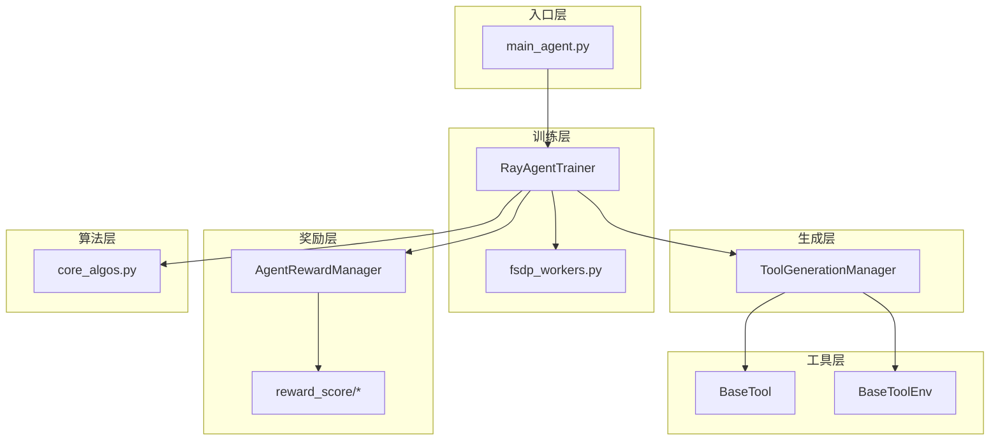
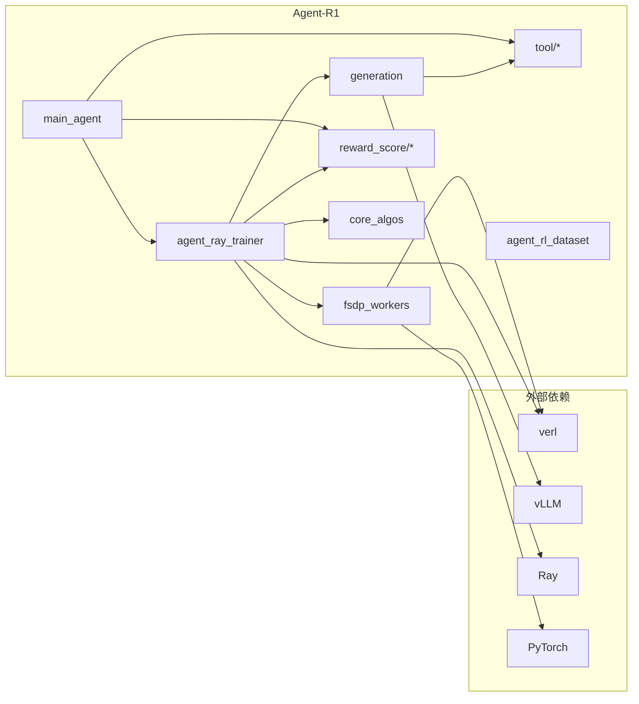

# 代码结构详解

本文档详细介绍 Agent-R1 代码库的组织结构、各模块的职责和依赖关系。

---

## 整体架构

Agent-R1 采用模块化设计，主要包含以下几个核心部分：



---

## 目录结构详解

### `agent_r1/` - 核心包

```
agent_r1/
├── llm_agent/           # LLM 代理模块
├── src/                 # 核心训练逻辑
├── tool/                # 工具系统
└── vllm_infer/          # 推理工具
```

---

## 核心模块详解

### 1. 入口点：`main_agent.py`

**路径**: `agent_r1/src/main_agent.py`

**职责**:
- 初始化 Ray 集群
- 加载配置和 tokenizer
- 创建工具和环境实例
- 实例化并启动训练器

**核心函数**:

```python
@hydra.main(config_path="config", config_name="agent_trainer", version_base=None)
def main(config):
    run_agent(config)

def run_agent(config) -> None:
    # 1. 初始化 Ray
    if not ray.is_initialized():
        ray.init(...)

    # 2. 启动 TaskRunner
    runner = TaskRunner.remote()
    ray.get(runner.run.remote(config))

@ray.remote(num_cpus=1)
class TaskRunner:
    def run(self, config):
        # 3. 加载 tokenizer 和 processor
        tokenizer = hf_tokenizer(local_path, ...)
        processor = hf_processor(local_path, ...)

        # 4. 定义 worker 类
        from .fsdp_workers import ActorRolloutRefWorker, CriticWorker

        # 5. 创建资源池
        resource_pool_manager = ResourcePoolManager(...)

        # 6. 加载工具和环境
        tools = [_default_tool(name) for name in config.tool.tools]
        env = _default_env(config.tool.env)(tools=tools, ...)

        # 7. 创建数据集
        train_dataset = create_rl_dataset(...)
        val_dataset = create_rl_dataset(...)

        # 8. 创建并运行训练器
        trainer = RayAgentTrainer(...)
        trainer.init_workers()
        trainer.fit()
```

**关键导入**:
- `RayAgentTrainer`: 主训练器
- `_default_tool`, `_default_env`: 工具和环境工厂函数
- `load_reward_manager`: 奖励管理器加载

---

### 2. 训练器：`agent_ray_trainer.py`

**路径**: `agent_r1/src/agent_ray_trainer.py`

**职责**:
- 编排分布式训练流程
- 管理 Actor、Critic、Reference Policy 等工作组
- 执行生成-评估-优化循环

**核心类**:

#### `Role` 枚举

```python
class Role(Enum):
    Actor = 0
    Rollout = 1
    ActorRollout = 2
    Critic = 3
    RefPolicy = 4
    RewardModel = 5
    ActorRolloutRef = 6
```

#### `AdvantageEstimator` 枚举

```python
class AdvantageEstimator(str, Enum):
    GAE = "gae"
    GRPO = "grpo"
    REINFORCE_PLUS_PLUS = "reinforce_plus_plus"
    REINFORCE_PLUS_PLUS_BASELINE = "reinforce_plus_plus_baseline"
    REMAX = "remax"
    RLOO = "rloo"
```

#### `ResourcePoolManager` 数据类

```python
@dataclass
class ResourcePoolManager:
    resource_pool_spec: dict[str, list[int]]  # 资源池规格
    mapping: dict[Role, str]                   # 角色到资源池的映射
    resource_pool_dict: dict[str, RayResourcePool]  # 资源池实例

    def create_resource_pool(self): ...
    def get_resource_pool(self, role: Role) -> RayResourcePool: ...
    def get_n_gpus(self) -> int: ...
```

#### `RayAgentTrainer` 类

主要方法：

| 方法 | 功能 |
|------|------|
| `__init__` | 初始化训练器，配置各组件 |
| `init_workers` | 初始化分布式工作组 |
| `fit` | 主训练循环 |
| `_generate` | 执行多轮生成（rollout） |
| `_compute_reward` | 计算奖励 |
| `_compute_advantage` | 计算优势函数 |
| `_update_actor` | 更新 Actor 策略 |
| `_update_critic` | 更新 Critic 值函数 |
| `_validate` | 执行验证 |
| `_save_checkpoint` | 保存检查点 |

**训练循环流程**:

```python
def fit(self):
    for epoch in range(total_epochs):
        for batch in dataloader:
            # 1. 生成阶段
            gen_output = self._generate(batch, env)

            # 2. 奖励计算
            rewards = self._compute_reward(gen_output)

            # 3. 参考策略对数概率
            ref_log_probs = self._compute_ref_log_prob(gen_output)

            # 4. 值函数估计（如果使用 critic）
            values = self._compute_values(gen_output)

            # 5. 优势计算
            advantages = self._compute_advantage(rewards, values)

            # 6. 策略更新
            self._update_actor(gen_output, advantages)

            # 7. 值函数更新
            self._update_critic(gen_output)

            # 8. 验证和保存
            if step % test_freq == 0:
                self._validate()
            if step % save_freq == 0:
                self._save_checkpoint()
```

---

### 3. 分布式工作器：`fsdp_workers.py`

**路径**: `agent_r1/src/fsdp_workers.py`

**职责**:
- 实现 FSDP（Fully Sharded Data Parallel）分布式训练
- 封装 Actor、Critic、Reference Policy 的前向和反向传播

**核心类**:

#### `ActorRolloutRefWorker`

统一的工作器，处理 Actor、Rollout 和 Reference Policy 角色：

```python
class ActorRolloutRefWorker:
    """
    支持的角色:
    - Actor: 策略模型的训练
    - Rollout: 生成轨迹
    - RefPolicy: 参考策略（用于 KL 散度）
    """

    def init_model(self): ...
    def compute_log_prob(self, batch): ...
    def compute_ref_log_prob(self, batch): ...
    def update_actor(self, batch, advantages): ...
    def generate(self, prompts): ...
```

#### `CriticWorker`

值函数模型工作器：

```python
class CriticWorker:
    def init_model(self): ...
    def compute_values(self, batch): ...
    def update_critic(self, batch, returns): ...
```

**关键特性**:

- **Device Mesh**: 支持 FSDP 和混合分片
- **Flash Attention**: 集成高效注意力计算
- **序列并行**: 支持 Ulysses 序列并行
- **参数卸载**: 支持 CPU/磁盘卸载以节省 GPU 内存

---

### 4. 生成管理器：`generation.py`

**路径**: `agent_r1/llm_agent/generation.py`

**职责**:
- 管理多轮生成流程
- 协调 LLM 生成与工具调用
- 维护 Action Mask

**核心类**: `ToolGenerationManager`

```python
class ToolGenerationManager:
    def __init__(self, tokenizer, ...): ...

    def run_llm_loop(self, gen_batch, env):
        """
        主生成循环

        Returns:
            - responses: 完整响应序列
            - log_probs: 对数概率
            - entropies: 熵
            - action_masks: 动作掩码
        """
        for turn in range(max_turns):
            # 1. 生成响应
            responses = self._generate(prompts)

            # 2. 检查是否应该停止
            if env.stop(responses):
                break

            # 3. 提取工具调用
            tool_calls = env.extract_tool_calls(responses)

            # 4. 执行工具并获取响应
            tool_responses = env.step(tool_calls)

            # 5. 更新状态
            prompts = self._update_state(prompts, responses, tool_responses)

            # 6. 更新 Action Mask
            action_masks = self._update_action_mask(...)

        return responses, log_probs, entropies, action_masks
```

**关键配置**: `ToolGenerationConfig`

```python
@dataclass
class ToolGenerationConfig:
    max_turns: int = 5                    # 最大交互轮数
    max_response_length: int = 8192       # 最大响应长度
    max_response_length_single_turn: int = 1024  # 单轮最大长度
    temperature: float = 1.0              # 采样温度
    top_p: float = 1.0                    # nucleus 采样
```

---

### 5. 核心算法：`core_algos.py`

**路径**: `agent_r1/src/core_algos.py`

**职责**:
- 实现各种 RL 算法的核心计算
- 优势估计、损失函数、KL 惩罚

**核心函数**:

#### 优势估计函数

```python
def compute_gae_advantage_return(rewards, values, gamma, lambda_, action_mask):
    """使用 GAE 计算优势和回报"""
    ...

def compute_grpo_outcome_advantage(rewards, prompt_ids, action_mask):
    """GRPO: 按 prompt 分组的相对优势"""
    ...

def compute_reinforce_plus_plus_outcome_advantage(rewards, action_mask):
    """REINFORCE++ 优势计算"""
    ...

def compute_rloo_outcome_advantage(rewards, prompt_ids, action_mask):
    """RLOO: Leave-One-Out 基线优势"""
    ...

def compute_remax_outcome_advantage(rewards, baseline_rewards, action_mask):
    """ReMax: 使用 argmax 采样作为基线"""
    ...
```

#### 损失函数

```python
def compute_policy_loss(log_probs, old_log_probs, advantages, clip_ratio, action_mask):
    """PPO 裁剪策略损失"""
    ratio = torch.exp(log_probs - old_log_probs)
    clipped_ratio = torch.clamp(ratio, 1 - clip_ratio, 1 + clip_ratio)
    loss = -torch.min(ratio * advantages, clipped_ratio * advantages)
    return masked_mean(loss, action_mask)

def compute_value_loss(values, old_values, returns, clip_ratio, action_mask):
    """值函数损失（带裁剪）"""
    ...

def compute_entropy_loss(logits, action_mask):
    """熵损失（用于鼓励探索）"""
    ...
```

#### KL 控制器

```python
class AdaptiveKLController:
    """自适应 KL 系数控制器"""
    def __init__(self, init_kl_coef, target_kl): ...
    def update(self, current_kl): ...

class FixedKLController:
    """固定 KL 系数控制器"""
    def __init__(self, kl_coef): ...
```

---

### 6. 工具系统：`tool/`

**路径**: `agent_r1/tool/`

详细内容参见 [04_tool_system.md](./04_tool_system.md)

```
tool/
├── base.py              # BaseTool, BaseToolEnv 基类
├── utils.py             # 工具辅助函数
├── tools/               # 工具实现
│   ├── __init__.py      # 工具注册
│   ├── python_tool.py   # Python 执行工具
│   ├── search_tool.py   # 搜索工具
│   └── wiki_search_tool.py  # Wikipedia 搜索
└── envs/                # 环境实现
    ├── __init__.py      # 环境注册
    ├── nous.py          # Nous 环境
    ├── mathtir.py       # 数学环境
    └── retool.py        # ReTool 环境
```

---

### 7. 奖励系统：`reward_score/`

**路径**: `agent_r1/src/reward_score/`

详细内容参见 [07_reward_system.md](./07_reward_system.md)

```
reward_score/
├── __init__.py          # 奖励函数注册
├── gsm8k.py             # GSM8K 数学奖励
├── math.py              # 通用数学奖励
├── qa_em_and_format.py  # QA 精确匹配奖励
└── retool.py            # ReTool 奖励
```

---

### 8. 数据集：`agent_rl_dataset.py`

**路径**: `agent_r1/src/agent_rl_dataset.py`

**核心类**: `ToolRLDataset`

```python
class ToolRLDataset(Dataset):
    """支持工具调用的 RL 数据集"""

    def __init__(self, data_files, tokenizer, processor, config, env):
        self.data = self._load_data(data_files)
        self.tokenizer = tokenizer
        self.processor = processor
        self.env = env

    def __getitem__(self, idx):
        item = self.data[idx]

        # 应用聊天模板（包含工具描述）
        prompt = self._apply_chat_template(item, self.env)

        # 处理多模态输入（如果有）
        if self.processor:
            inputs = self._process_multimodal(item)

        return {
            "input_ids": ...,
            "attention_mask": ...,
            "ground_truth": item["reward_model"]["ground_truth"],
            ...
        }
```

---

### 9. 推理模块：`vllm_infer/`

**路径**: `agent_r1/vllm_infer/`

```
vllm_infer/
├── __init__.py
├── config.py    # 推理配置
├── run.py       # 推理运行脚本
└── chat.py      # 交互式对话
```

**核心功能**:
- 加载训练好的模型
- 提供 vLLM 服务
- 支持交互式对话和批量推理

---

## 模块依赖关系



---

## 关键文件大小参考

| 文件 | 行数 | 功能 |
|------|------|------|
| `agent_ray_trainer.py` | ~1200 | 主训练器 |
| `fsdp_workers.py` | ~1500 | 分布式工作器 |
| `generation.py` | ~500 | 生成管理器 |
| `core_algos.py` | ~600 | RL 算法 |
| `main_agent.py` | ~260 | 入口点 |
| `base.py` (tool) | ~100 | 工具基类 |

---

## 配置系统

**配置文件路径**: `agent_r1/src/config/agent_trainer.yaml`

配置使用 [Hydra](https://hydra.cc/) 管理，支持：
- 命令行覆盖
- 配置组合
- 环境变量插值

详细配置说明参见 [09_running_experiments.md](./09_running_experiments.md)

---

## 下一步

- [04_tool_system.md](./04_tool_system.md) - 深入了解 Tool 系统
- [05_environment_system.md](./05_environment_system.md) - 深入了解 ToolEnv 系统
- [06_training_pipeline.md](./06_training_pipeline.md) - 深入了解训练流程
