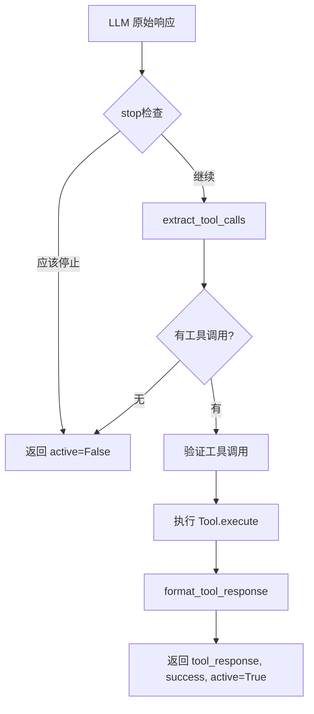
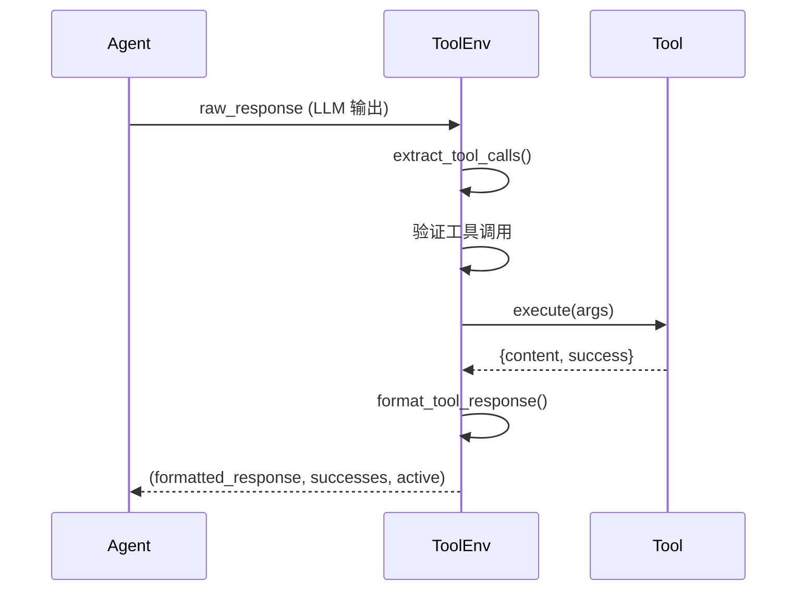

# ToolEnv 系统详解

本文档详细介绍 Agent-R1 的 ToolEnv 系统设计，包括 `BaseToolEnv` 抽象类、现有环境实现以及如何创建自定义环境。

---

## 概述

在 Agent-R1 框架中，**ToolEnv**（工具环境）扮演着强化学习环境中的编排器和解释器角色。与 Tool 不同，ToolEnv 负责：

1. **管理状态转换**: 接收 Agent 的原始输出，更新环境状态
2. **协调工具调用**: 解析 LLM 响应中的工具调用请求
3. **计算奖励信号**: 根据工具执行结果和任务进展计算奖励
4. **打包新状态**: 将环境反馈格式化后返回给 Agent

简而言之：
- **Tool**: 报告"发生了什么"
- **ToolEnv**: 决定"这对 Agent 和任务意味着什么"

---

## BaseToolEnv 抽象类

**路径**: `agent_r1/tool/base.py`

### 类定义

```python
from abc import ABC, abstractmethod
from typing import List, Tuple, Any
import torch

class BaseToolEnv(ABC):
    @abstractmethod
    def step(self, raw_response: str) -> Tuple[str, List[bool], bool]:
        """
        环境的状态转移函数

        Args:
            raw_response: LLM 的原始响应文本

        Returns:
            tool_response: 工具响应（格式化后）
            success: 每个工具调用是否成功的列表
            active: 轨迹是否仍然活跃（是否需要继续交互）
        """
        pass

    def batch_step(self, raw_responses: List[str]) -> Tuple[List[str], List[List[bool]], List[bool]]:
        """批量执行 step"""
        results = [self.step(raw_response) for raw_response in raw_responses]
        return (
            [result[0] for result in results],
            [result[1] for result in results],
            [result[2] for result in results]
        )

    def process_responses_ids(self, tokenizer, raw_responses_ids: torch.Tensor) -> torch.Tensor:
        """处理响应的 token IDs（可选重写）"""
        return raw_responses_ids

    @abstractmethod
    def stop(self, raw_response: str) -> bool:
        """判断是否应该停止交互"""
        pass

    @abstractmethod
    def extract_tool_calls(self, raw_response: str) -> List[Any]:
        """从 LLM 响应中提取工具调用"""
        pass

    @abstractmethod
    def format_tool_response(self, tool_responses: List[str]) -> str:
        """格式化工具响应列表"""
        pass

    @property
    def system_prompt(self) -> str:
        """返回系统提示（可选）"""
        return ""
```

> **注意**: 虽然基类的抽象方法声明参数为 `tool_response: str`，但所有实际实现都使用 `tool_responses: List[str]` 以支持多个工具响应的批量处理。

### 核心方法说明

| 方法 | 类型 | 说明 |
|------|------|------|
| `step()` | 抽象方法 | **核心方法** - 执行一步环境交互 |
| `batch_step()` | 可重写 | 批量执行 step，可优化性能 |
| `stop()` | 抽象方法 | 判断轨迹是否应该终止 |
| `extract_tool_calls()` | 抽象方法 | 解析 LLM 输出中的工具调用 |
| `format_tool_response()` | 抽象方法 | 格式化工具响应列表为 LLM 可理解的格式 |
| `process_responses_ids()` | 可重写 | 处理原始 token IDs |
| `system_prompt` | 属性 | 返回环境特定的系统提示 |

### step() 方法返回值详解

```python
Tuple[str, List[bool], bool]
#     │     │          │
#     │     │          └── active: 轨迹是否活跃
#     │     │              True = 继续交互
#     │     │              False = 停止交互
#     │     │
#     │     └── success: 每个工具调用的成功状态
#     │         例如: [True, False] 表示第一个工具成功，第二个失败
#     │
#     └── tool_response: 格式化后的工具响应文本
```

---

## BaseImageToolEnv 类

对于需要处理图像输出的多模态任务，Agent-R1 提供了 `BaseImageToolEnv` 基类：

**路径**: `agent_r1/tool/base.py`

```python
class BaseImageToolEnv(BaseToolEnv, ABC):
    @abstractmethod
    def step(self, raw_response: str) -> Tuple[str, List[Image.Image], List[bool], bool]:
        """
        支持图像输出的环境状态转移函数

        Returns:
            tool_response: 工具响应文本
            images: 生成的图像列表
            success: 每个工具调用是否成功
            active: 轨迹是否活跃
        """
        pass

    def batch_step(self, raw_responses: List[str]) -> Tuple[List[str], List[List[Image.Image]], List[List[bool]], List[bool]]:
        """批量执行，返回值包含图像列表"""
        results = [self.step(raw_response) for raw_response in raw_responses]
        return (
            [result[0] for result in results],
            [result[1] for result in results],
            [result[2] for result in results],
            [result[3] for result in results]
        )
```

### 主要区别

| 特性 | BaseToolEnv | BaseImageToolEnv |
|------|-------------|------------------|
| step() 返回值 | `(str, List[bool], bool)` | `(str, List[Image], List[bool], bool)` |
| 图像支持 | 否 | 是 |
| 适用场景 | 文本工具 | 图像生成、视觉任务 |

---

## 状态转换流程



---

## 现有环境实现

### 1. NousToolEnv - Nous 工具环境

**路径**: `agent_r1/tool/envs/nous.py`

**用途**: 多跳 QA 任务，支持 OpenAI 兼容的函数调用格式

**工具调用格式**:
```xml
<tool_call>
{"name": "search", "arguments": {"query": "example"}}
</tool_call>
```

**响应格式**:
```xml
<tool_response>
{"results": [...]}
</tool_response>
```

**实现代码**:

```python
class NousToolEnv(BaseToolEnv):
    def __init__(self, tools: List[BaseTool], max_tool_response_length: int):
        self.tools = tools
        self.tool_map = {tool.name: tool for tool in self.tools}
        self.tool_call_start = "<tool_call>"
        self.tool_call_end = "</tool_call>"
        self.tool_response_start = "<tool_response>"
        self.tool_response_end = "</tool_response>"
        self.eos_token = "<|im_end|>"
        self.parallel_tool_calls = False
        self.max_tool_response_length = max_tool_response_length

    def step(self, raw_response: str) -> Tuple[str, List[bool], bool]:
        # 1. 提取工具调用
        tool_calls = self.extract_tool_calls(raw_response)
        if len(tool_calls) == 0:
            return "", [], False

        # 2. 如果不支持并行调用，只取第一个
        if not self.parallel_tool_calls:
            tool_calls = [tool_calls[0]]

        # 3. 执行每个工具调用
        tool_responses = []
        tool_successes = []
        for tool_call in tool_calls:
            if tool_call is None:
                tool_responses.append("Error: JSONDecodeError")
                tool_successes.append(False)
            elif "name" not in tool_call:
                tool_responses.append("Error: No tool name")
                tool_successes.append(False)
            elif tool_call["name"] not in self.tool_map:
                tool_responses.append("Error: ToolNotFoundError")
                tool_successes.append(False)
            else:
                tool = self.tool_map[tool_call["name"]]
                if not tool.validate_args(tool_call["arguments"]):
                    tool_responses.append("Error: Invalid tool arguments")
                    tool_successes.append(False)
                else:
                    result = tool.execute(tool_call["arguments"])
                    tool_responses.append(result["content"])
                    tool_successes.append(result["success"])

        # 4. 格式化响应
        tool_response = self.format_tool_response(tool_responses)
        return tool_response, tool_successes, True

    def extract_tool_calls(self, raw_response: str) -> List[Any]:
        """使用正则表达式提取 <tool_call>...</tool_call> 中的 JSON"""
        import re
        import json

        tool_calls = []
        pattern = re.compile(
            f"{re.escape(self.tool_call_start)}(.*?){re.escape(self.tool_call_end)}",
            re.DOTALL
        )
        for tool_call in re.findall(pattern, raw_response):
            try:
                tool_calls.append(json.loads(tool_call))
            except json.JSONDecodeError:
                tool_calls.append(None)
        return tool_calls

    def format_tool_response(self, tool_responses: List[str]) -> str:
        """格式化工具响应，添加适当的聊天模板标记"""
        tool_message = "<|im_end|>\n<|im_start|>user\n"
        for i, tool_response in enumerate(tool_responses):
            if len(tool_response) > self.max_tool_response_length:
                tool_response = tool_response[:self.max_tool_response_length] + "..."
            tool_message += f"<tool_response>\n{tool_response}\n</tool_response>"
            if i < len(tool_responses) - 1:
                tool_message += "\n"
        tool_message += "<|im_end|>\n<|im_start|>assistant\n<think>\n"
        return tool_message

    def stop(self, raw_response: str) -> bool:
        """如果没有工具调用，则停止"""
        return len(self.extract_tool_calls(raw_response)) == 0
```

### 2. ReToolEnv - ReTool 代码执行环境

**路径**: `agent_r1/tool/envs/retool.py`

**用途**: 数学推理任务，通过代码执行进行计算

**工具调用格式**:
```xml
<code>
print(1 + 2)
</code>
```

**响应格式**:
```xml
<interpreter>
3
</interpreter>
```

**实现代码**:

```python
class ReToolEnv(BaseToolEnv):
    def __init__(self, tools: List[BaseTool], max_tool_response_length: int):
        self.tool = tools[0]
        assert self.tool.name == "python"
        self.max_tool_response_length = max_tool_response_length

    def step(self, raw_response: str) -> Tuple[str, List[bool], bool]:
        code = self.extract_tool_calls(raw_response)
        if len(code) == 0:
            return "", [], False
        code = code[0]
        tool_response, tool_success = self.tool.execute({"code": code})
        tool_response = self.format_tool_response([tool_response])
        return tool_response, [tool_success], True

    def extract_tool_calls(self, raw_response: str) -> List[Any]:
        """提取 <code>...</code> 中的代码"""
        code = ''
        start = False
        for line in raw_response.split('\n'):
            if line.startswith('<code>'):
                code += '\n# ========\n'
                start = True
            elif line.startswith('</code>'):
                start = False
            elif start:
                if line.startswith('```'):
                    continue
                code += line + '\n'
        if start or len(code) == 0:
            return []
        return [code]

    def format_tool_response(self, tool_responses: List[str]) -> str:
        if len(tool_responses) == 0:
            return ""
        response = tool_responses[0]
        if len(response) > self.max_tool_response_length:
            response = response[:self.max_tool_response_length] + "..."
        return "\n<interpreter>\n" + response + "\n</interpreter>\n"

    def stop(self, raw_response: str) -> bool:
        return len(self.extract_tool_calls(raw_response)) == 0
```

---

## 环境注册

环境通过工厂函数注册和获取：

**路径**: `agent_r1/tool/envs/__init__.py`

```python
def _default_env(name):
    """环境工厂函数"""
    if name == "nous":
        from agent_r1.tool.envs.nous import NousToolEnv
        return NousToolEnv
    elif name == "retool":
        from agent_r1.tool.envs.retool import ReToolEnv
        return ReToolEnv
    else:
        raise NotImplementedError(f"Tool environment {name} is not implemented")
```

在配置中使用：

```yaml
tool:
  env: nous          # 或 retool
  max_tool_response_length: 2000
```

---

## 创建自定义环境

### 示例：创建 SQL 查询环境

假设我们要创建一个支持 SQL 查询的环境：

#### 步骤 1: 创建环境类

在 `agent_r1/tool/envs/` 目录下创建 `sql_env.py`：

```python
from agent_r1.tool.base import BaseToolEnv, BaseTool
from typing import List, Tuple, Any
import re
import json

class SQLToolEnv(BaseToolEnv):
    """SQL 查询工具环境"""

    def __init__(self, tools: List[BaseTool], max_tool_response_length: int):
        self.tools = tools
        self.tool_map = {tool.name: tool for tool in self.tools}
        self.max_tool_response_length = max_tool_response_length

        # 定义标记
        self.sql_start = "<sql>"
        self.sql_end = "</sql>"
        self.result_start = "<result>"
        self.result_end = "</result>"

    def step(self, raw_response: str) -> Tuple[str, List[bool], bool]:
        """执行一步环境交互"""
        # 1. 提取 SQL 查询
        queries = self.extract_tool_calls(raw_response)
        if len(queries) == 0:
            return "", [], False

        # 2. 执行查询
        results = []
        successes = []
        for query in queries:
            if "sql_executor" in self.tool_map:
                tool = self.tool_map["sql_executor"]
                result = tool.execute({"query": query})
                results.append(result["content"])
                successes.append(result["success"])
            else:
                results.append("Error: SQL executor not found")
                successes.append(False)

        # 3. 格式化响应
        response = self.format_tool_response(results)
        return response, successes, True

    def batch_step(self, raw_responses: List[str]) -> Tuple[List[str], List[List[bool]], List[bool]]:
        """优化的批量执行"""
        all_responses = []
        all_successes = []
        all_active = []

        # 收集所有查询
        batch_queries = []
        batch_indices = []
        for i, raw_response in enumerate(raw_responses):
            queries = self.extract_tool_calls(raw_response)
            if len(queries) == 0:
                all_responses.append("")
                all_successes.append([])
                all_active.append(False)
            else:
                all_responses.append(None)  # 占位
                all_successes.append(None)
                all_active.append(True)
                for query in queries:
                    batch_queries.append({"query": query})
                    batch_indices.append(i)

        # 批量执行
        if "sql_executor" in self.tool_map and batch_queries:
            tool = self.tool_map["sql_executor"]
            batch_results = tool.batch_execute(batch_queries)

            # 整理结果
            results_by_index = {}
            successes_by_index = {}
            for idx, result in zip(batch_indices, batch_results):
                if idx not in results_by_index:
                    results_by_index[idx] = []
                    successes_by_index[idx] = []
                results_by_index[idx].append(result["content"])
                successes_by_index[idx].append(result["success"])

            for i in results_by_index:
                all_responses[i] = self.format_tool_response(results_by_index[i])
                all_successes[i] = successes_by_index[i]

        return all_responses, all_successes, all_active

    def stop(self, raw_response: str) -> bool:
        """如果没有 SQL 查询，则停止"""
        return len(self.extract_tool_calls(raw_response)) == 0

    def extract_tool_calls(self, raw_response: str) -> List[Any]:
        """提取 <sql>...</sql> 中的 SQL 查询"""
        pattern = re.compile(
            f"{re.escape(self.sql_start)}(.*?){re.escape(self.sql_end)}",
            re.DOTALL
        )
        return [query.strip() for query in re.findall(pattern, raw_response)]

    def format_tool_response(self, results: List[str]) -> str:
        """格式化 SQL 执行结果"""
        response = "<|im_end|>\n<|im_start|>user\n"
        for i, result in enumerate(results):
            if len(result) > self.max_tool_response_length:
                result = result[:self.max_tool_response_length] + "..."
            response += f"{self.result_start}\n{result}\n{self.result_end}"
            if i < len(results) - 1:
                response += "\n"
        response += "<|im_end|>\n<|im_start|>assistant\n"
        return response

    @property
    def system_prompt(self) -> str:
        """SQL 环境的系统提示"""
        return """You are a data analyst assistant. When you need to query data,
use the following format:

<sql>
SELECT * FROM table_name WHERE condition;
</sql>

The query result will be returned in <result>...</result> tags."""
```

#### 步骤 2: 注册环境

修改 `agent_r1/tool/envs/__init__.py`：

```python
def _default_env(name):
    if name == "nous":
        from agent_r1.tool.envs.nous import NousToolEnv
        return NousToolEnv
    elif name == "retool":
        from agent_r1.tool.envs.retool import ReToolEnv
        return ReToolEnv
    # 添加新环境
    elif name == "sql":
        from agent_r1.tool.envs.sql_env import SQLToolEnv
        return SQLToolEnv
    else:
        raise NotImplementedError(f"Tool environment {name} is not implemented")
```

#### 步骤 3: 在配置中使用

```yaml
tool:
  env: sql
  tools:
    - sql_executor
  max_tool_response_length: 2000
```

---

## 批量执行优化

`batch_step()` 方法对于训练效率至关重要。以下是优化建议：

### 1. 收集所有请求后批量处理

```python
def batch_step(self, raw_responses: List[str]) -> Tuple[...]:
    # 第一遍：收集所有工具调用
    all_tool_calls = []
    call_indices = []
    for i, response in enumerate(raw_responses):
        calls = self.extract_tool_calls(response)
        for call in calls:
            all_tool_calls.append(call)
            call_indices.append(i)

    # 批量执行
    if all_tool_calls:
        batch_results = self.tool.batch_execute(all_tool_calls)

    # 整理结果
    # ...
```

### 2. 按工具类型分组

```python
def batch_step(self, raw_responses: List[str]) -> Tuple[...]:
    # 按工具类型分组
    calls_by_tool = {}  # tool_name -> [(index, call), ...]

    for i, response in enumerate(raw_responses):
        for call in self.extract_tool_calls(response):
            tool_name = call["name"]
            if tool_name not in calls_by_tool:
                calls_by_tool[tool_name] = []
            calls_by_tool[tool_name].append((i, call))

    # 每种工具批量执行
    for tool_name, calls in calls_by_tool.items():
        tool = self.tool_map[tool_name]
        results = tool.batch_execute([c["arguments"] for _, c in calls])
        # 处理结果...
```

---

## 环境设计最佳实践

### 1. 清晰的工具调用格式

使用明确的开始和结束标记：

```python
# 好的设计
self.tool_call_start = "<tool_call>"
self.tool_call_end = "</tool_call>"

# 避免：容易被混淆的标记
self.tool_call_start = "CALL:"
```

### 2. 健壮的解析

处理各种边界情况：

```python
def extract_tool_calls(self, raw_response: str) -> List[Any]:
    tool_calls = []
    pattern = re.compile(f"{re.escape(self.start)}(.*?){re.escape(self.end)}", re.DOTALL)

    for match in re.findall(pattern, raw_response):
        try:
            # 尝试解析
            parsed = json.loads(match.strip())
            # 验证必要字段
            if "name" in parsed and "arguments" in parsed:
                tool_calls.append(parsed)
            else:
                tool_calls.append(None)  # 标记为无效
        except json.JSONDecodeError:
            tool_calls.append(None)

    return tool_calls
```

### 3. 信息丰富的错误消息

```python
def step(self, raw_response: str) -> Tuple[str, List[bool], bool]:
    # ...
    if tool_name not in self.tool_map:
        available_tools = ", ".join(self.tool_map.keys())
        error_msg = f"Error: Tool '{tool_name}' not found. Available: {available_tools}"
        return self.format_tool_response([error_msg]), [False], True
```

### 4. 响应长度限制

防止过长的响应影响训练：

```python
def format_tool_response(self, responses: List[str]) -> str:
    formatted = []
    for response in responses:
        if len(response) > self.max_tool_response_length:
            response = response[:self.max_tool_response_length] + "\n[Response truncated...]"
        formatted.append(response)
    return self._build_response(formatted)
```

---

## 与 Tool 的协作关系



---

## 下一步

- [06_training_pipeline.md](./06_training_pipeline.md) - 了解训练流程如何使用 ToolEnv
- [07_reward_system.md](./07_reward_system.md) - 了解如何基于环境交互设计奖励
