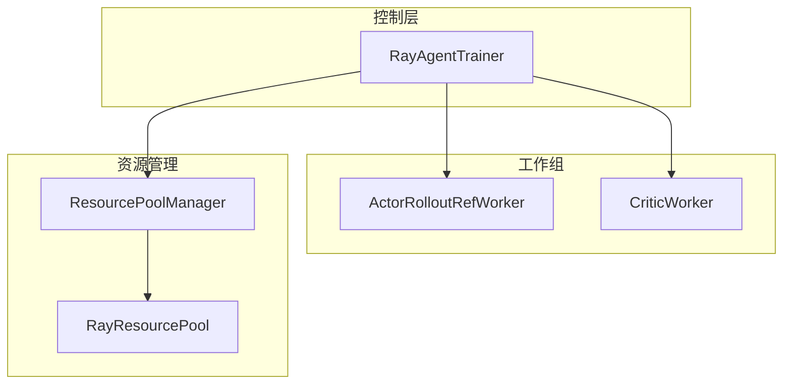
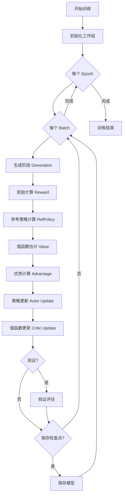

# 训练流程详解

本文档详细介绍 Agent-R1 的训练流程，包括分布式训练架构、生成阶段、学习阶段以及支持的 RL 算法。

---

## 训练架构概览

Agent-R1 采用基于 Ray 的分布式训练架构，主要组件包括：



### 核心组件

| 组件 | 职责 |
|------|------|
| **RayAgentTrainer** | 主训练器，编排整个训练流程 |
| **ActorRolloutRefWorker** | 统一的 Actor/Rollout/Ref 工作器 |
| **CriticWorker** | 值函数估计工作器 |
| **ResourcePoolManager** | GPU 资源分配管理 |
| **ToolGenerationManager** | 多轮生成管理 |

---

## 训练流程

### 整体流程图



### 详细流程

#### 1. 初始化阶段

```python
def init_workers(self):
    """初始化分布式工作组"""
    # 1. 创建资源池
    self.resource_pool_manager.create_resource_pool()

    # 2. 初始化 Actor-Rollout-Ref 工作组
    self.actor_rollout_wg = self._create_worker_group(
        Role.ActorRollout,
        actor_rollout_cls
    )

    # 3. 初始化 Critic 工作组（如果使用）
    if self.use_critic:
        self.critic_wg = self._create_worker_group(
            Role.Critic,
            critic_cls
        )

    # 4. 初始化 Reference Policy（如果使用 KL）
    if self.use_ref_policy:
        self.ref_policy_wg = self._create_worker_group(
            Role.RefPolicy,
            ref_cls
        )

    # 5. 初始化模型
    self.actor_rollout_wg.init_model()
    if self.use_critic:
        self.critic_wg.init_model()
```

#### 2. 生成阶段 (Generation)

多轮交互生成是 Agent-R1 的核心特色：

```python
def _generate(self, batch, env):
    """
    多轮生成流程

    Args:
        batch: 输入数据批次
        env: 工具环境实例

    Returns:
        gen_output: 包含响应、对数概率、熵、action mask 等
    """
    # 初始化生成管理器
    gen_manager = ToolGenerationManager(
        tokenizer=self.tokenizer,
        max_turns=self.config.tool.max_turns,
        max_response_length=self.config.data.max_response_length,
        ...
    )

    # 执行多轮生成
    gen_output = gen_manager.run_llm_loop(
        gen_batch=batch,
        env=env
    )

    return gen_output
```

**多轮生成循环**:

```python
def run_llm_loop(self, gen_batch, env):
    """多轮 LLM 生成循环"""
    for turn in range(self.max_turns):
        # 1. 生成响应
        responses, log_probs, entropies = self._generate_once(prompts)

        # 2. 检查是否停止
        should_stop = env.stop(responses)
        if all(should_stop):
            break

        # 3. 提取工具调用并执行
        tool_responses, successes, actives = env.batch_step(responses)

        # 4. 更新状态
        prompts = self._update_state(prompts, responses, tool_responses)

        # 5. 更新 Action Mask
        action_masks = self._update_action_mask(action_masks, ...)

    return {
        "responses": responses,
        "log_probs": log_probs,
        "entropies": entropies,
        "action_masks": action_masks,
        "process_rewards": process_rewards
    }
```

#### 3. 奖励计算 (Reward Computation)

```python
def _compute_reward(self, gen_output):
    """计算奖励"""
    # 结果奖励
    outcome_rewards = self.reward_fn(gen_output)

    # 过程奖励（如果启用）
    if self.config.algorithm.use_process_reward:
        process_rewards = gen_output["process_rewards"]
        # 归一化过程奖励
        process_rewards = self._normalize_process_rewards(process_rewards)
        total_rewards = outcome_rewards + process_rewards
    else:
        total_rewards = outcome_rewards

    return total_rewards
```

#### 4. 优势计算 (Advantage Computation)

根据配置的算法类型计算优势：

```python
def _compute_advantage(self, rewards, values, action_mask):
    """计算优势函数"""
    estimator = self.config.algorithm.adv_estimator

    if estimator == "gae":
        # GAE: 需要 Critic 值函数
        advantages, returns = compute_gae_advantage_return(
            rewards=rewards,
            values=values,
            gamma=self.config.algorithm.gamma,
            lambda_=self.config.algorithm.lam,
            action_mask=action_mask
        )

    elif estimator == "grpo":
        # GRPO: 按 prompt 分组的相对优势
        advantages = compute_grpo_outcome_advantage(
            rewards=rewards,
            prompt_ids=gen_output["prompt_ids"],
            action_mask=action_mask
        )
        returns = None  # GRPO 不需要 returns

    elif estimator == "reinforce_plus_plus":
        # REINFORCE++: 累积回报
        advantages = compute_reinforce_plus_plus_outcome_advantage(
            rewards=rewards,
            action_mask=action_mask
        )
        returns = None

    elif estimator == "rloo":
        # RLOO: Leave-One-Out 基线
        advantages = compute_rloo_outcome_advantage(
            rewards=rewards,
            prompt_ids=gen_output["prompt_ids"],
            action_mask=action_mask
        )
        returns = None

    return advantages, returns
```

#### 5. 策略更新 (Actor Update)

```python
def _update_actor(self, gen_output, advantages):
    """更新 Actor 策略"""
    # 构建更新数据
    update_data = {
        "responses": gen_output["responses"],
        "old_log_probs": gen_output["log_probs"],
        "advantages": advantages,
        "action_mask": gen_output["action_masks"]
    }

    # 调用工作组更新
    metrics = self.actor_rollout_wg.update_actor(update_data)

    return metrics
```

#### 6. 值函数更新 (Critic Update)

```python
def _update_critic(self, gen_output, returns):
    """更新 Critic 值函数"""
    if not self.use_critic:
        return {}

    update_data = {
        "responses": gen_output["responses"],
        "old_values": gen_output["values"],
        "returns": returns,
        "action_mask": gen_output["action_masks"]
    }

    metrics = self.critic_wg.update_critic(update_data)

    return metrics
```

---

## 支持的 RL 算法

### 1. PPO (Proximal Policy Optimization)

**特点**: 使用值函数和 GAE 进行优势估计，带裁剪的策略梯度

**配置**:
```yaml
algorithm:
  adv_estimator: gae
  gamma: 0.99
  lam: 0.95
  clip_ratio: 0.2
  use_kl_in_reward: true
```

**损失函数**:

$$L^{CLIP}(\theta) = \mathbb{E}_t \left[ \min \left( r_t(\theta) \hat{A}_t, \text{clip}(r_t(\theta), 1-\epsilon, 1+\epsilon) \hat{A}_t \right) \right]$$

其中 $r_t(\theta) = \frac{\pi_\theta(a_t|s_t)}{\pi_{\theta_{old}}(a_t|s_t)}$

### 2. GRPO (Group Relative Policy Optimization)

**特点**: 无需 Critic，按 prompt 分组计算相对优势

**配置**:
```yaml
algorithm:
  adv_estimator: grpo
  grpo_normalize_by_std: true
```

**优势计算**:

$$\hat{A}_i = \frac{r_i - \mu(r_{\text{group}})}{\sigma(r_{\text{group}})}$$

### 3. REINFORCE++

**特点**: 累积回报

**配置**:
```yaml
algorithm:
  adv_estimator: reinforce_plus_plus
```

**优势计算**:

$$\hat{A}_t = \sum_{k=t}^{T} \gamma^{k-t} r_k$$

### 3.1 REINFORCE++ Baseline

**特点**: 累积回报，使用基线减少方差

**配置**:
```yaml
algorithm:
  adv_estimator: reinforce_plus_plus_baseline
```

**优势计算**:

$$\hat{A}_t = \sum_{k=t}^{T} \gamma^{k-t} r_k - b$$

其中 $b$ 是用于减少方差的基线值。

### 4. RLOO (Leave-One-Out)

**特点**: 使用组内其他样本作为基线

**配置**:
```yaml
algorithm:
  adv_estimator: rloo
```

**优势计算**:

$$\hat{A}_i = r_i - \frac{1}{n-1} \sum_{j \neq i} r_j$$

### 5. ReMax

**特点**: 使用 argmax 采样作为基线

**配置**:
```yaml
algorithm:
  adv_estimator: remax
```

---

## Action Mask 机制

Action Mask 是 Agent-R1 的关键创新，用于区分代理动作和环境反馈：

### 创建 Action Mask

```python
def _create_action_mask(self, responses, tool_responses_positions):
    """
    创建 Action Mask

    Args:
        responses: 完整响应序列
        tool_responses_positions: 工具响应在序列中的位置

    Returns:
        action_mask: 二进制掩码
            1 = Agent 生成的 token（参与梯度计算）
            0 = 环境反馈 token（不参与梯度计算）
    """
    action_mask = torch.ones_like(responses)

    for batch_idx, positions in enumerate(tool_responses_positions):
        for start, end in positions:
            action_mask[batch_idx, start:end] = 0

    return action_mask
```

### Action Mask 应用

```python
def compute_policy_loss(log_probs, old_log_probs, advantages, action_mask, clip_ratio):
    """计算带 Action Mask 的策略损失"""
    # 计算概率比率
    ratio = torch.exp(log_probs - old_log_probs)

    # PPO 裁剪
    clipped_ratio = torch.clamp(ratio, 1 - clip_ratio, 1 + clip_ratio)

    # 计算损失
    loss1 = ratio * advantages
    loss2 = clipped_ratio * advantages
    loss = -torch.min(loss1, loss2)

    # 应用 Action Mask：只对 Agent 动作计算损失
    masked_loss = loss * action_mask
    final_loss = masked_loss.sum() / action_mask.sum()

    return final_loss
```

---

## KL 散度控制

防止策略更新过大，保持训练稳定性：

### 自适应 KL 控制器

```python
class AdaptiveKLController:
    """
    自适应 KL 系数控制器
    根据实际 KL 散度调整惩罚系数
    """

    def __init__(self, init_kl_coef, target_kl, horizon):
        self.value = init_kl_coef
        self.target = target_kl
        self.horizon = horizon

    def update(self, current_kl, n_steps):
        """根据当前 KL 更新系数"""
        proportional_error = np.clip(current_kl / self.target - 1, -0.2, 0.2)
        mult = 1 + proportional_error * n_steps / self.horizon
        self.value *= mult
```

### KL 惩罚应用

```python
def apply_kl_penalty(rewards, log_probs, ref_log_probs, kl_coef):
    """应用 KL 惩罚到奖励"""
    # 计算 KL 散度
    kl_divergence = log_probs - ref_log_probs

    # 惩罚后的奖励
    penalized_rewards = rewards - kl_coef * kl_divergence

    return penalized_rewards
```

---

## 分布式训练

### FSDP (Fully Sharded Data Parallel)

Agent-R1 使用 FSDP 进行高效的分布式训练：

```python
# fsdp_workers.py 中的配置
class ActorRolloutRefWorker:
    def init_model(self):
        # 创建 Device Mesh
        self.device_mesh = create_device_mesh(
            world_size=self.world_size,
            fsdp_size=self.config.fsdp_size
        )

        # 应用 FSDP 包装
        self.model = FSDP(
            self.model,
            device_mesh=self.device_mesh,
            sharding_strategy=ShardingStrategy.FULL_SHARD,
            ...
        )
```

### 序列长度平衡

跨 DP rank 平衡序列长度，避免负载不均：

```python
def get_seqlen_balanced_partitions(batch, num_partitions):
    """
    按序列长度平衡分区

    确保每个 GPU 处理相近的总 token 数
    """
    # 计算每个样本的序列长度
    seq_lens = [len(sample["input_ids"]) for sample in batch]

    # 贪心分配：将长序列优先分配给负载较轻的 GPU
    partitions = [[] for _ in range(num_partitions)]
    partition_lens = [0] * num_partitions

    for idx in sorted(range(len(seq_lens)), key=lambda i: -seq_lens[i]):
        min_partition = min(range(num_partitions), key=lambda p: partition_lens[p])
        partitions[min_partition].append(idx)
        partition_lens[min_partition] += seq_lens[idx]

    return partitions
```

---

## 检查点管理

### 保存检查点

```python
def _save_checkpoint(self, step):
    """保存训练检查点"""
    # 1. 保存 Actor 模型
    self.actor_rollout_wg.save_checkpoint(
        path=f"{self.save_dir}/actor_step_{step}"
    )

    # 2. 保存 Critic 模型（如果使用）
    if self.use_critic:
        self.critic_wg.save_checkpoint(
            path=f"{self.save_dir}/critic_step_{step}"
        )

    # 3. 保存训练状态
    torch.save({
        "step": step,
        "epoch": self.current_epoch,
        "kl_coef": self.kl_ctrl.value,
    }, f"{self.save_dir}/training_state_{step}.pt")
```

### 恢复检查点

```python
def _load_checkpoint(self, path):
    """从检查点恢复"""
    # 1. 恢复模型权重
    self.actor_rollout_wg.load_checkpoint(f"{path}/actor")

    # 2. 恢复训练状态
    state = torch.load(f"{path}/training_state.pt")
    self.current_step = state["step"]
    self.current_epoch = state["epoch"]
```

---

## 训练监控

### 关键指标

| 指标 | 说明 |
|------|------|
| `reward/mean` | 平均奖励 |
| `reward/std` | 奖励标准差 |
| `policy/approx_kl` | 近似 KL 散度 |
| `policy/entropy` | 策略熵 |
| `loss/actor` | Actor 损失 |
| `loss/critic` | Critic 损失 |
| `accuracy/em` | 精确匹配准确率 |
| `metrics/turns` | 平均交互轮数 |

### 日志配置

```yaml
trainer:
  logger:
    - type: console
    - type: wandb
      project: agent-r1
      name: experiment-1
```

---

## 训练配置示例

```yaml
# 完整训练配置示例
data:
  train_batch_size: 128
  max_prompt_length: 8192
  max_response_length: 8192

actor_rollout_ref:
  actor:
    strategy: fsdp
    ppo_epochs: 1
    lr: 1e-6
  rollout:
    name: vllm
    gpu_memory_utilization: 0.6
    temperature: 1.0
    top_p: 1.0

critic:
  strategy: fsdp
  lr: 1e-5

algorithm:
  adv_estimator: grpo  # 或 gae, reinforce_plus_plus, reinforce_plus_plus_baseline, rloo, remax
  gamma: 0.99
  lam: 0.95
  clip_ratio: 0.2
  use_kl_in_reward: false
  kl_ctrl:
    type: fixed
    kl_coef: 0.001

tool:
  env: nous
  tools:
    - search
  max_turns: 5
  max_tool_response_length: 2000

trainer:
  total_epochs: 1
  test_freq: 10
  save_freq: 100
  val_before_train: true
  n_gpus_per_node: 4
  nnodes: 1
```

---

## 下一步

- [07_reward_system.md](./07_reward_system.md) - 深入了解奖励系统
- [09_running_experiments.md](./09_running_experiments.md) - 实际运行实验
