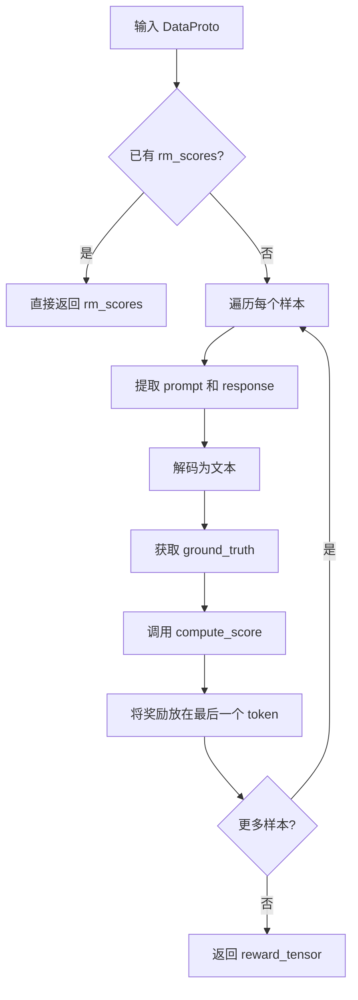

# 奖励系统详解

本文档详细介绍 Agent-R1 的奖励系统设计，包括 `AgentRewardManager`、现有奖励函数以及如何创建自定义奖励。

---

## 概述

Agent-R1 的奖励系统支持两种类型的奖励：

1. **结果奖励 (Outcome Reward)**: 在任务完成时评估最终答案的正确性
2. **过程奖励 (Process Reward)**: 在每个工具调用后评估中间步骤的有效性

这种双重奖励机制使 Agent 能够学习何时以及如何有效地使用工具。

---

## AgentRewardManager

**路径**: `agent_r1/src/agent_reward_manager.py`

### 类定义

```python
class AgentRewardManager:
    """Agent 奖励管理器"""

    def __init__(self, tokenizer, num_examine, compute_score=None, reward_fn_key="data_source"):
        """
        Args:
            tokenizer: 分词器
            num_examine: 打印到控制台的解码响应批次数
            compute_score: 自定义评分函数（可选）
            reward_fn_key: 用于选择奖励函数的键名
        """
        self.tokenizer = tokenizer
        self.num_examine = num_examine
        self.compute_score = compute_score or _default_compute_score
        self.reward_fn_key = reward_fn_key

    def __call__(self, data: DataProto, return_dict=False):
        """计算奖励"""
        # ...
```

### 工作流程



### 核心逻辑

```python
def __call__(self, data: DataProto, return_dict=False):
    # 初始化奖励张量
    reward_tensor = torch.zeros_like(data.batch["responses"], dtype=torch.float32)
    reward_extra_info = defaultdict(list)

    for i in range(len(data)):
        data_item = data[i]

        # 1. 提取有效的 prompt 和 response
        prompt_ids = data_item.batch["prompts"]
        response_ids = data_item.batch["responses"]
        valid_response_length = data_item.batch["attention_mask"][prompt_length:].sum()

        # 2. 解码为文本
        sequences = torch.cat((valid_prompt_ids, valid_response_ids))
        sequences_str = self.tokenizer.decode(sequences, skip_special_tokens=False)

        # 3. 获取 ground truth 和数据源
        ground_truth = data_item.non_tensor_batch["reward_model"]["ground_truth"]
        data_source = data_item.non_tensor_batch[self.reward_fn_key]

        # 4. 计算分数
        score = self.compute_score(
            data_source=data_source,
            solution_str=sequences_str,
            ground_truth=ground_truth,
            extra_info=extra_info,
        )

        # 5. 提取奖励值
        if isinstance(score, dict):
            reward = score["score"]
            for key, value in score.items():
                reward_extra_info[key].append(value)
        else:
            reward = score

        # 6. 将奖励放在响应的最后一个 token 位置
        reward_tensor[i, valid_response_length - 1] = reward

    return reward_tensor
```

---

## 默认奖励函数

**路径**: `agent_r1/src/reward_score/__init__.py`

### 统一接口

```python
def _default_compute_score(data_source, solution_str, ground_truth, extra_info=None):
    """
    默认的综合评分函数

    Returns:
        dict: {
            "score": 综合分数（用于 RL 训练）,
            "acc": 答案准确率,
            "format": 格式正确性
        }
    """
    return {
        "score": _default_compute_score_format_answer(data_source, solution_str, ground_truth, extra_info),
        "acc": _default_compute_score_answer(data_source, solution_str, ground_truth, extra_info),
        "format": _default_compute_score_format(data_source, solution_str, extra_info),
    }
```

### 支持的数据源

| 数据源 | 奖励模块 | 说明 |
|--------|----------|------|
| `hotpotqa/hotpot_qa` | `qa_em_and_format` | HotpotQA 多跳 QA |
| `bdsaglam/musique` | `qa_em_and_format` | MuSiQue 多跳 QA |
| `xanhho/2WikiMultihopQA` | `qa_em_and_format` | 2WikiMultiHop QA |
| `openai/gsm8k` | `gsm8k` | GSM8K 数学 |
| `BytedTsinghua-SIA/DAPO-Math-17k` | `retool` | ReTool 数学 |

---

## QA 任务奖励函数

**路径**: `agent_r1/src/reward_score/qa_em_and_format.py`

### 答案归一化

```python
def normalize_answer(s):
    """标准化答案以进行公平比较"""
    def remove_articles(text):
        return re.sub(r"\b(a|an|the)\b", " ", text)

    def white_space_fix(text):
        return " ".join(text.split())

    def remove_punc(text):
        exclude = set(string.punctuation)
        return "".join(ch for ch in text if ch not in exclude)

    def lower(text):
        return text.lower()

    return white_space_fix(remove_articles(remove_punc(lower(s))))
```

### 精确匹配检查

```python
def em_check(prediction, golden_answers):
    """精确匹配检查"""
    if isinstance(golden_answers, str):
        golden_answers = [golden_answers]
    normalized_prediction = normalize_answer(prediction)
    for golden_answer in golden_answers:
        if normalize_answer(golden_answer) == normalized_prediction:
            return 1.0
    return 0.0

def subem_check(prediction, golden_answers):
    """子串匹配检查"""
    if isinstance(golden_answers, str):
        golden_answers = [golden_answers]
    normalized_prediction = normalize_answer(prediction)
    for golden_answer in golden_answers:
        if normalize_answer(golden_answer) in normalized_prediction:
            return 1.0
    return 0.0
```

### 格式奖励

```python
def compute_score_format(solution_str):
    """
    计算格式奖励

    检查响应是否遵循预期格式：
    - <think>...</think> 标签
    - <tool_call>...</tool_call> 标签
    - <answer>...</answer> 标签

    Returns:
        float: 格式奖励 (0.0 - 1.0)
    """
    format_reward = 0.0

    # 提取 assistant 块
    assistant_blocks = re.findall(
        r'<\|im_start\|>assistant\n(.*?)<\|im_end\|>',
        solution_str,
        re.DOTALL
    )

    if not assistant_blocks:
        return 0.0

    # 检查中间块的格式（<think> + <tool_call>）
    for i, block in enumerate(assistant_blocks[:-1]):
        if (block.count('<think>') == 1 and
            block.count('</think>') == 1 and
            block.count('<tool_call>') == 1 and
            block.count('</tool_call>') == 1):
            think_match = re.search(
                r'^<think>(.*?)</think>(\s*)<tool_call>(.*?)</tool_call>$',
                block,
                re.DOTALL
            )
            if think_match:
                format_reward += 0.5

    # 检查最后一个块的格式（<think> + <answer>）
    last_block = assistant_blocks[-1]
    think_answer_match = re.search(
        r'^<think>(.*?)</think>(.*?)<answer>(.*?)</answer>$',
        last_block,
        re.DOTALL
    )
    if think_answer_match:
        format_reward += 0.5

    return format_reward
```

### 综合奖励

```python
def compute_score_format_answer(solution_str, ground_truth):
    """
    计算综合奖励（格式 + 答案）

    奖励公式：
    - 如果格式奖励 >= 0.5: score = -1.0 + format_reward + answer_reward
    - 否则: score = -1.0 + format_reward

    这意味着只有格式正确时才考虑答案奖励
    """
    format_reward = compute_score_format(solution_str)
    answer_reward = compute_score_answer(solution_str, ground_truth)

    format_reward = min(format_reward, 1.0)

    if format_reward >= 0.5:
        return -1.0 + format_reward + answer_reward
    else:
        return -1.0 + format_reward
```

---

## 奖励公式

Agent-R1 使用以下奖励公式：

$$r_f = \begin{cases} r_{answer}, & \text{if } r_{format} = 1 \\ r_{format} - 1, & \text{if } r_{format} < 1 \end{cases}$$

### 奖励分解

| 组件 | 值范围 | 说明 |
|------|--------|------|
| `format_reward` | 0.0 - 1.0 | 格式正确性 |
| `answer_reward` | 0.0 - 1.0 | 答案准确性 |
| `final_score` | -1.0 - 1.0 | 综合分数 |

### 奖励逻辑示意

```
格式不正确 (format < 0.5):
  final_score = -1.0 + format  → 负奖励，惩罚格式错误

格式部分正确 (0.5 <= format < 1.0):
  final_score = -1.0 + format + answer  → 考虑答案，但基准为负

格式完全正确 (format = 1.0):
  final_score = 0.0 + answer  → 完全基于答案正确性
```

---

## 过程奖励

### 概念

过程奖励在每个工具调用后提供反馈，帮助 Agent 学习有效的工具使用策略。

### 实现位置

过程奖励在 `ToolGenerationManager.run_llm_loop()` 中收集：

```python
def run_llm_loop(self, gen_batch, env):
    process_rewards = []

    for turn in range(self.max_turns):
        # 执行工具调用
        tool_responses, successes, actives = env.batch_step(responses)

        # 收集过程奖励
        turn_rewards = []
        for success in successes:
            if success:
                turn_rewards.append(self.process_reward_for_success)
            else:
                turn_rewards.append(self.process_reward_for_failure)
        process_rewards.append(turn_rewards)

    return {
        # ...
        "process_rewards": process_rewards
    }
```

### 过程奖励归一化

为了平衡过程奖励和结果奖励，使用 PRIME 风格的归一化：

```python
def normalize_process_rewards(process_rewards, outcome_rewards):
    """
    归一化过程奖励，使其与结果奖励在同一尺度

    基于 PRIME: https://github.com/PRIME-RL/PRIME
    """
    # 计算统计量
    outcome_mean = outcome_rewards.mean()
    outcome_std = outcome_rewards.std()
    process_mean = process_rewards.mean()
    process_std = process_rewards.std()

    # 归一化
    normalized = (process_rewards - process_mean) / (process_std + 1e-8)
    scaled = normalized * outcome_std + outcome_mean

    return scaled
```

---

## 创建自定义奖励函数

### 方法 1: 添加新数据源支持

在 `agent_r1/src/reward_score/` 目录下创建新模块：

```python
# agent_r1/src/reward_score/my_task.py

def compute_score_format(solution_str):
    """格式检查"""
    # 实现格式验证逻辑
    pass

def compute_score_answer(solution_str, ground_truth):
    """答案检查"""
    # 实现答案验证逻辑
    pass

def compute_score_format_answer(solution_str, ground_truth):
    """综合评分"""
    format_score = compute_score_format(solution_str)
    answer_score = compute_score_answer(solution_str, ground_truth)
    # 组合逻辑
    return final_score
```

然后在 `__init__.py` 中注册：

```python
def _default_compute_score_format(data_source, solution_str, extra_info=None):
    # ... 现有代码 ...
    elif data_source == 'my_namespace/my_task':
        from . import my_task
        res = my_task.compute_score_format(solution_str)
    # ...
```

### 方法 2: 自定义奖励函数文件

创建独立的奖励函数文件：

```python
# my_reward.py

def compute_score(data_source, solution_str, ground_truth, extra_info=None):
    """
    自定义奖励函数

    Args:
        data_source: 数据源标识
        solution_str: 完整的响应字符串
        ground_truth: 正确答案
        extra_info: 额外信息（可选）

    Returns:
        dict: {
            "score": float,  # 用于 RL 训练的主分数
            "acc": float,    # 准确率指标
            "format": float  # 格式分数
        }
    """
    # 提取答案
    answer = extract_answer(solution_str)

    # 计算各项分数
    format_score = check_format(solution_str)
    answer_score = check_answer(answer, ground_truth)

    return {
        "score": compute_final_score(format_score, answer_score),
        "acc": answer_score,
        "format": format_score
    }
```

在配置中使用：

```yaml
reward_model:
  custom_reward_function:
    path: /path/to/my_reward.py
    name: compute_score
    reward_kwargs:
      custom_param: value
```

---

## 奖励设计最佳实践

### 1. 奖励稀疏性

避免过于稀疏的奖励：

```python
# 不好：只有完全正确才给奖励
def compute_score(solution_str, ground_truth):
    if exact_match(solution_str, ground_truth):
        return 1.0
    return 0.0

# 好：部分正确也给部分奖励
def compute_score(solution_str, ground_truth):
    score = 0.0
    if format_correct(solution_str):
        score += 0.3
    if partial_match(solution_str, ground_truth):
        score += 0.4
    if exact_match(solution_str, ground_truth):
        score += 0.3
    return score
```

### 2. 奖励尺度

保持奖励在合理范围内：

```python
# 推荐范围：-1.0 到 1.0
def compute_score(...):
    # 基础分数
    base = -1.0

    # 累加正向奖励
    if condition_1:
        base += 0.5
    if condition_2:
        base += 0.5
    if condition_3:
        base += 1.0

    return max(-1.0, min(1.0, base))  # 裁剪到 [-1, 1]
```

### 3. 格式与内容分离

分别评估格式和内容：

```python
def compute_score(solution_str, ground_truth):
    format_score = compute_format_score(solution_str)
    content_score = compute_content_score(solution_str, ground_truth)

    # 只有格式正确时才考虑内容
    if format_score >= FORMAT_THRESHOLD:
        return format_score * 0.3 + content_score * 0.7
    else:
        return format_score * 0.5 - 0.5  # 惩罚格式错误
```

### 4. 调试友好

返回详细的评分信息：

```python
def compute_score(solution_str, ground_truth):
    return {
        "score": final_score,
        "acc": accuracy,
        "format": format_score,
        "answer_extracted": extracted_answer,  # 用于调试
        "match_type": match_type,              # 用于分析
    }
```

---

## 奖励系统配置

```yaml
reward_model:
  enable: false  # 是否使用模型作为奖励模型
  reward_kwargs:
    # 传递给奖励函数的额外参数

algorithm:
  use_process_reward: true  # 是否使用过程奖励
  process_reward_weight: 0.1  # 过程奖励权重
```

---

## 下一步

- [08_data_preparation.md](./08_data_preparation.md) - 了解数据格式要求
- [09_running_experiments.md](./09_running_experiments.md) - 运行实验
